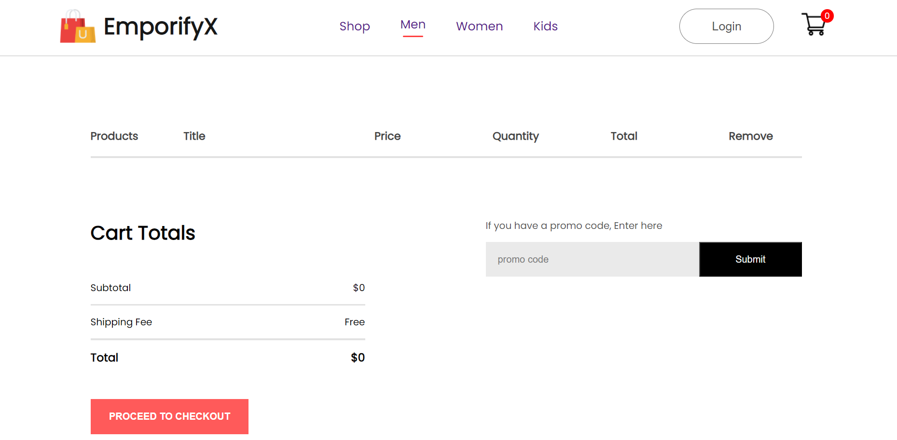
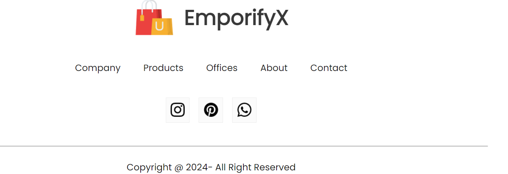

# 🛍️ E-Commerce Website Frontend

# Overview

EmporifyX is a modern, responsive e-commerce website frontend built for a seamless online shopping experience. It features an intuitive UI, product browsing, cart management, and a user-friendly checkout process. Designed with performance and scalability in mind, this project enhances the user journey from product discovery to purchase.

# Features

🔍 Product Listings & Categories – Browse items with search and filter options

🛒 Cart & Wishlist – Add, remove, and manage products effortlessly

🔄 Smooth Navigation – Responsive design for all devices

🔐 Login & Authentication – Secure user login and signup functionality

🎨 Modern UI/UX – Clean and interactive user interface

⚡ Fast & Optimized – Built for speed and performance

# Tech Stack

Frontend: React.js

Styling: CSS

State Management: Context API

# Setup Instructions

1. Clone the repository: git clone <repo-url>
2. Install dependencies: npm install
3. Start the project: npm start
4. Open in browser: http://localhost:3000
   
 
 

## Screenshots

 

 
## NewsLetter

 
## Cart Page

 
## Log-In Page

 
## Footer

